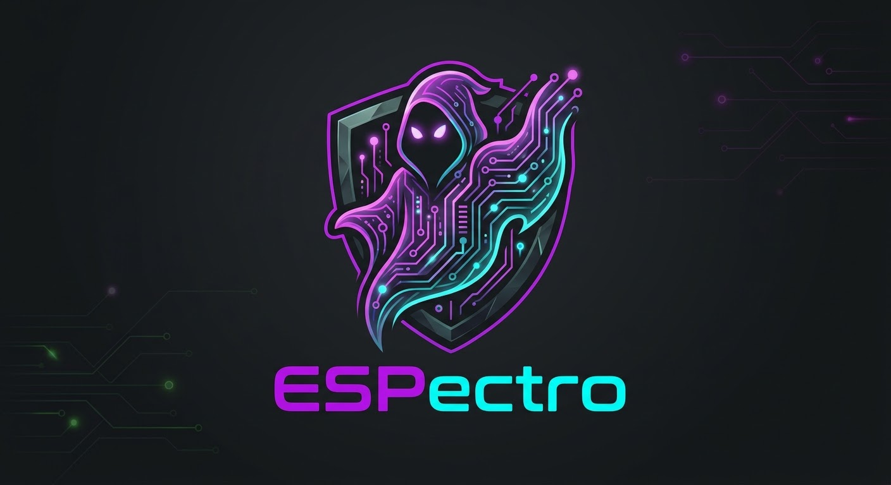

# ESPectro

  <a href="README.md">🇬🇧 English</a> · <a href="README.es.md">🇪🇸 Español</a>

  

  
  
  
  

🚧 **En construcción** — el hardware y la documentación todavía se están desarrollando.

Un dispositivo DIY multifunción de pentesting basado en el firmware [ESP-HACK](https://github.com/Teapot174/ESP-HACK).

## Índice

- [Estado del proyecto](#estado-del-proyecto)
- [Lista de materiales](#lista-de-materiales)
- [Guía de cableado](#guía-de-cableado)
- [Problemas conocidos y decisiones de diseño](#problemas-conocidos-y-decisiones-de-diseño)
- [Instalación del firmware](#instalación-del-firmware)
- [Aviso legal](#aviso-legal)
- [Créditos](#créditos)

## Estado del proyecto

- [x] Componentes seleccionados y pedidos (BOM)
- [x] Firmware compilado y flasheado — ESP-HACK v1.2, entorno de display `SH1106`, funcionalidad de jammer deshabilitada (ver [Instalación del firmware](#instalación-del-firmware))
- [x] Display OLED cableado y verificado (SDA→G21, SCL→G22)
- [x] PCB personalizada pedida — diseño de referencia oficial de ESP-HACK (Gerbers de Teapot174 / Dripside, publicados en la carpeta `/others` del repositorio original), fabricada por JLCPCB — llegada estimada de 7 a 10 días hábiles
- [x] Prototipado en breadboard descartado definitivamente — problemas persistentes de contacto en los pines del header del ESP32 (ver [Problemas conocidos y decisiones de diseño](#problemas-conocidos-y-decisiones-de-diseño))
- [ ] Montaje final en la PCB (bloqueado hasta que llegue)
- [ ] Verificación funcional del módulo microSD
- [ ] Cableado y pruebas del módulo CC1101
- [ ] Cableado y pruebas de los botones
- [ ] Cableado y pruebas del emisor/receptor IR
- [ ] Carcasa impresa en 3D
- [ ] Documentación completa del montaje con fotos

## Guía de cableado

El pinout siguiente procede directamente de la configuración del firmware ESP-HACK (`src/CONFIG.h`) — el mismo mapa de GPIO que usa la PCB de referencia oficial en la que se basa este montaje, así que aplica tanto si construyes sobre la PCB, sobre perfboard, o sobre breadboard para pruebas.

### Display OLED (SH1106, I²C) — ✅ Cableado y verificado

| Pin del display | GPIO del ESP32 |
|---|---|
| VCC | 3V3 |
| GND | GND |
| SDA | G21 |
| SCL | G22 |

### Pulsadores de navegación — ⏳ Pendiente de montaje (PCB)

Cada pulsador conecta una pata al GPIO indicado y la otra a GND (el firmware usa pull-ups internas).

| Función | GPIO del ESP32 |
|---|---|
| UP | G27 |
| DOWN | G26 |
| OK | G33 |
| BACK | G32 |

### Módulo CC1101 433MHz (SPI) — ⏳ Pendiente de montaje (PCB)

| Pin del CC1101 | GPIO del ESP32 |
|---|---|
| VCC | 3V3 |
| GND | GND |
| SCK | G18 |
| MOSI | G23 |
| MISO | G19 |
| CSN (CS) | G5 |
| GDO0 | G4 |

### Módulo microSD (bus SPI dedicado) — ⏳ Cableado, verificación funcional pendiente

| Pin del módulo SD | GPIO del ESP32 |
|---|---|
| VCC | 3V3 |
| GND | GND |
| CS | G15 |
| MOSI | G13 |
| SCK (CLK) | G14 |
| MISO | G17 |

> La tarjeta SD funciona con su propia instancia SPI dedicada en firmware (`sdSPI`), independiente del bus SPI hardware del CC1101 de arriba — no comparten pines.

### Emisor / receptor IR — ⏳ Pendiente de montaje (PCB)

| Señal | GPIO del ESP32 |
|---|---|
| IR TX (emisor) | G16 |
| IR RX (receptor) | G35 |

### Header GPIO de expansión (opcional)

Reservado para módulos adicionales (iButton, NRF24, ST25R3916/RFID):

| Etiqueta | GPIO del ESP32 | Compartido con |
|---|---|---|
| GPIO_A | G16 | IR TX |
| GPIO_B | G2 | — |
| GPIO_C | G18 | CC1101 SCK |
| GPIO_D | G23 | CC1101 MOSI |
| GPIO_E | G19 | CC1101 MISO |
| GPIO_F | G25 | — |

Estos pines están multiplexados con otros periféricos de forma intencional — solo cablea un módulo adicional a un pin compartido si el periférico correspondiente no está montado en tu build.

## Problemas conocidos y decisiones de diseño

**Prototipado en breadboard — descartado.** El prototipado inicial usaba dos breadboards de 830 puntos con jumpers DuPont Hembra-Hembra directos al header del ESP32. Se abandonó tras fallos de contacto repetidos en los pines del header — el ajuste por fricción se degradaba rápido con el uso normal, haciendo la placa poco fiable más allá de pruebas cortas de banco.

**Resuelto: PCB de referencia oficial en lugar de diseño propio o perfboard.** En vez de diseñar una PCB desde cero o pasar a perfboard con soldadura manual, este montaje usa la **PCB de referencia oficial de ESP-HACK**, cuyos archivos Gerber publica el propio autor del firmware en la carpeta `/others` del repositorio original (diseño acreditado a **Teapot174** y **Dripside**). Reutilizar el diseño de referencia ya probado:

- garantiza que el pinout físico coincide exactamente con el mapa de GPIO del firmware (`src/CONFIG.h`), sin riesgo de descuadre entre cableado y firmware,
- ahorra por completo el tiempo de diseño y revisión de la PCB,
- se beneficia del uso previo de ese mismo diseño por la comunidad.

Las placas se pidieron a través de **JLCPCB**, con una llegada estimada de **7 a 10 días hábiles**.

> **Nota sobre la reutilización:** los archivos Gerber no son un diseño propio de este repositorio — pertenecen al proyecto original ESP-HACK. Si los incorporas a tu propio repo en lugar de solo enlazar a la fuente, mantén la atribución original y revisa la licencia del repositorio original antes de redistribuirlos.

El mapeo de pines y la constante de versión del firmware viven ambos en `src/CONFIG.h` — consulta la [Guía de cableado](#guía-de-cableado) para el mapa GPIO completo usado en este montaje.

## Créditos

- **Firmware:** [ESP-HACK](https://github.com/Teapot174/ESP-HACK) de Teapot174, licenciado bajo AGPL-3.0
- **Diseño de la PCB de referencia:** Teapot174 y Dripside — archivos Gerber publicados en la carpeta `/others` del repositorio original
- **Montaje de hardware, documentación de cableado y este repositorio:** [lank-one](https://github.com/lank-one)

